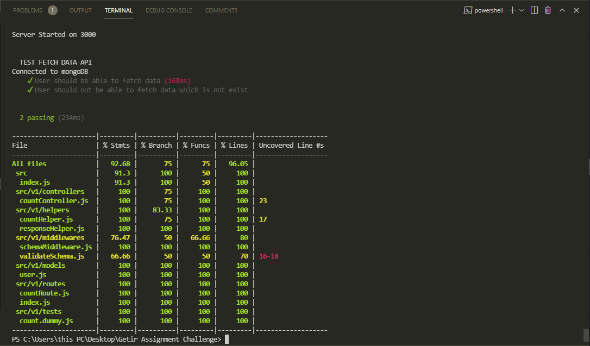

# BACKEND CHALLEGE

- This Backend Challenge

#### This is the Github repository of the getir assignment challenge 

https://github.com/key-joshua/getir-assignment-challenge

<br>

## Features

- Fetch Data Endpoint.
- Other Features Will Be Listed Here.

## Getir Challenge API

Before we get started Remember to take  :coffee:   :pizza:  and :dancer:   When You Are coding, come on Dude it all about relax

## Backend tools

 - Node Js.
 - Express JS.
 - Mongo Database.
 - Other Neccessary libraries.


#### TABLE OF API ENDPOINTS SPECIFICATION AND DESCRIPTION

- Version API using URL versioning starting with https://getir-assignment-challenge.herokuapp.com/api/v1


|NO  | VERBS  | ENDPOINTS                            | STATUS       | ACCESS      | DESCRIPTION                                |
|----|--------|--------------------------------------|--------------|-------------|--------------------------------------------|
| 1  | POST   | /api/v1/count/fetch-data             | 200 OK       | public      | fetch data by specified request            |
| 2  | Etc    | .....................                | ......       | ......      | ......................................     |


#### Other Tools

Other tools and technologies used in development of this application are;
- Hosting: [Heroku](https://heroku.com/).
- Compiler: [Babel](https://babeljs.io/).
- Style Guide: [Airbnb](https://airbnb.io/projects/javascript/).
- Framework: [ExpressJS](http://expressjs.com/).
- Documentation: [Swagger](https://swagger.io/).
- Linting Library: [ESLint](https://eslint.org/).
- API Testing environment: [Postman](https://www.getpostman.com).
- Programming language: [JavaScript(ES6)](https://developer.mozilla.org/en-US/docs/Web/JavaScript/).
- Text Editor: [VSCode](https://code.visualstudio.com), [Sublime Text](https://www.sublimetext.com/).


## HOSTED PROJECT [Access endpoint Direct]

- [Heroku URL](https://getir-assignment-challenge.herokuapp.com)


## GETTING START WITH PROJECT GLOBALLY


- [API Swagger Documentation](https://getir-assignment-challenge.herokuapp.com/api/v1/documentation)

## GETTING START WITH PROJECT LOCALLY

- Open your Gitbash/cmd and run command below to Clone repository into your local machine:
 ```
git clone https://github.com/key-joshua/getir-assignment-challenge.git
 ```
- Run command below to dive into cloned repository in your local machine:
 ```
cd getir-assignment-challenge
 ```
- Install the required dependencies found in package.json by running this command:
 ```
npm install
 ```
- And then start server by running this command below:
 ```
npm run server
 ```
- then to run the tests, run this commands:
 ```
npm run kill
```
 ```
- npm run test
```
